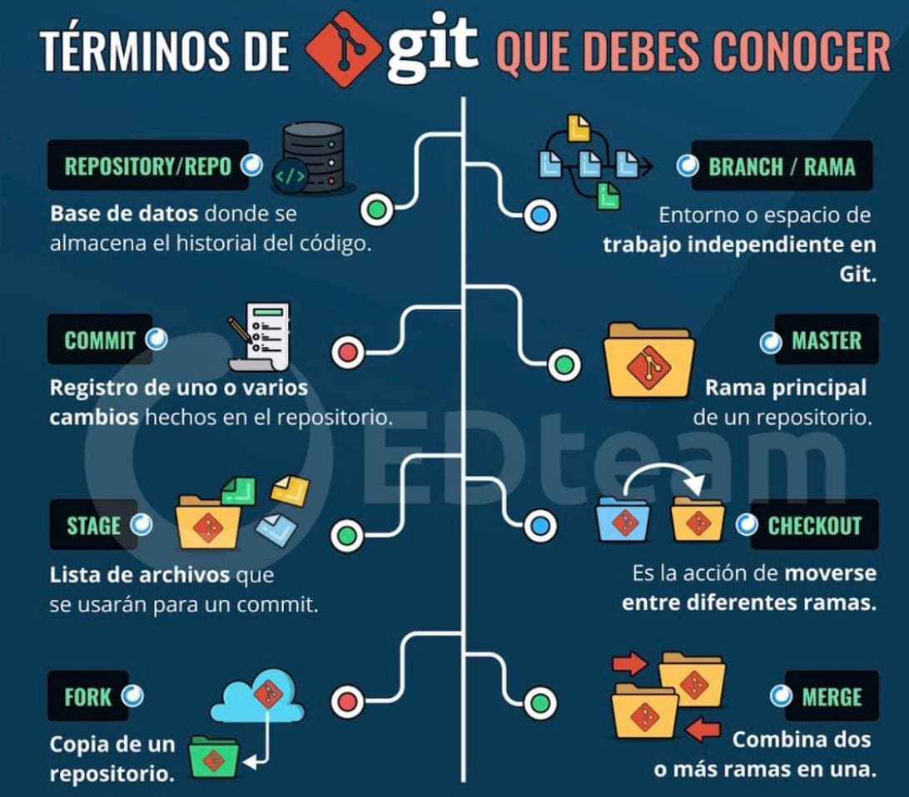

# CienciaDatos
PAPD - Ciencia de datos

## GIT

Git es una herramiento para llevar el control de proyectos.  **Colección** de Directorios y archivos

Incluye:

- Manejo de Versiones
- Facilita la colaboración
- Integra cambios  paralelos al mismo código
- Diferentes personas pueden trabajar en la misma parte del código
- Puedo saber quien, cuando y donde cambiaron alguna parte del código

No utiliza un modelo lineal, es algo mas complejo, pues puede crear ramas del mismo código para que 2 o mas personas lo trabajen
y posteriormente se pueda *integrar* en la versión difinitiva

Como exactamente se representa 

tipos de objetos:
 - blob (array(byte))
 - map <string, tree | blob>
 - commit = estructura
 
 Cada rama es un snapshot de los directorios y archivos, con metadata adicional que ayudan posteriormente a la unificación 
 del código.
 
 Al final lo que guarda son punteros en notación hexadecimal, con una referencia en lenguaje entendible.

### Comandos básicos

Comando | descripción
-- | --
init | Inicia un directorio para que trabaje con git
add | añade un archivo o directorio al repositorio
status | Despliega el status de nuestro repositorio
checkout | elimina los cambios realizados
commit | aplica los cambios realizados
push | Envía los cambios al repositorio general
pull | obtiene los cambios del repositorio general

### Pasos para iniciar un nuevo repositorio

1. git init
2. git add README.md
3. git commit -m "first commit"
4. git branch -M main
5. git remote add origin <URL/repositorio.git>
6. git push -u origin main

### Pasos para agregar un archivo

1. Crear el archivo
    make <filename>
2. git add <filename>
    

### pasos para enviarlo a la nube